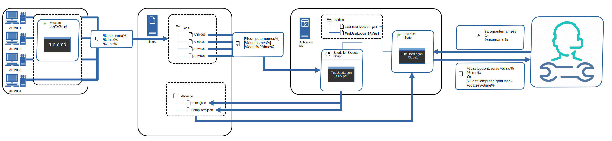

# FindUserLogons
Скрипт поиска компьютера по пользователю
и наоборот с сортировкой по времени входа для инженеров-техников.

Добавленый в планировщик скрипт FindUserLogons_SRV собирает данные о последнем входе 
пользователей на АРМ с последующим сохранением в JSON файл

FindUserLogons_CL - оперирует накопленной ранее базой и обеспечивает быстрый вывод истории входа

Для начала накопления логов добавьте run.cmd в LOGON GPO 

[findUserLogon](https://github.com/user-attachments/assets/1e479edc-98b5-4801-bfd5-543cbb0e92ff)

Внимание :

      ! Замените  <PATHTOLOGFOLDERS>  во всех скриптах на Ваш путь к папке хранения логов !
